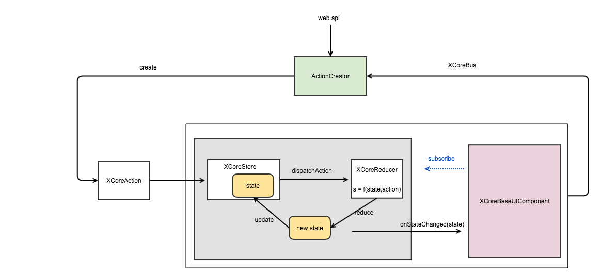
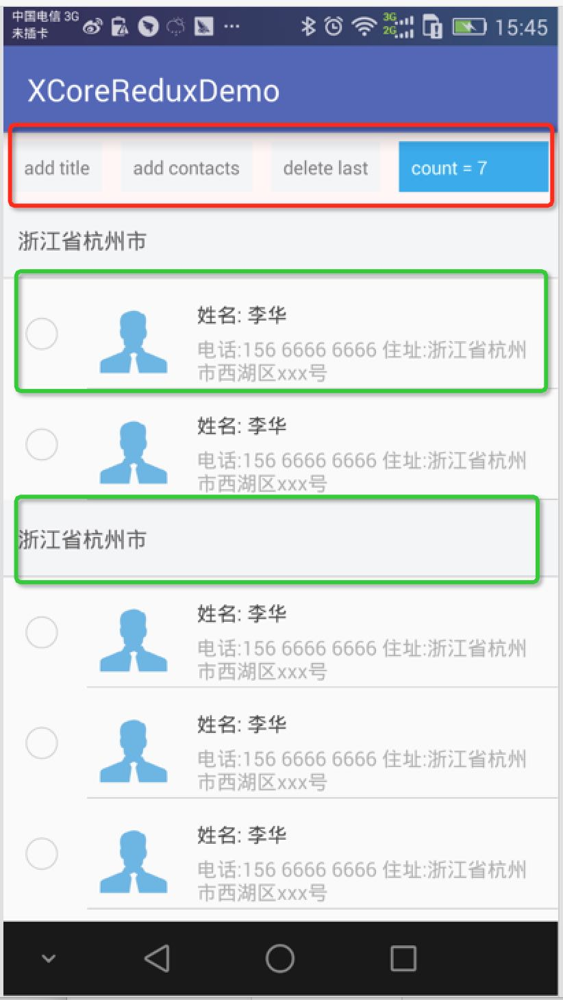
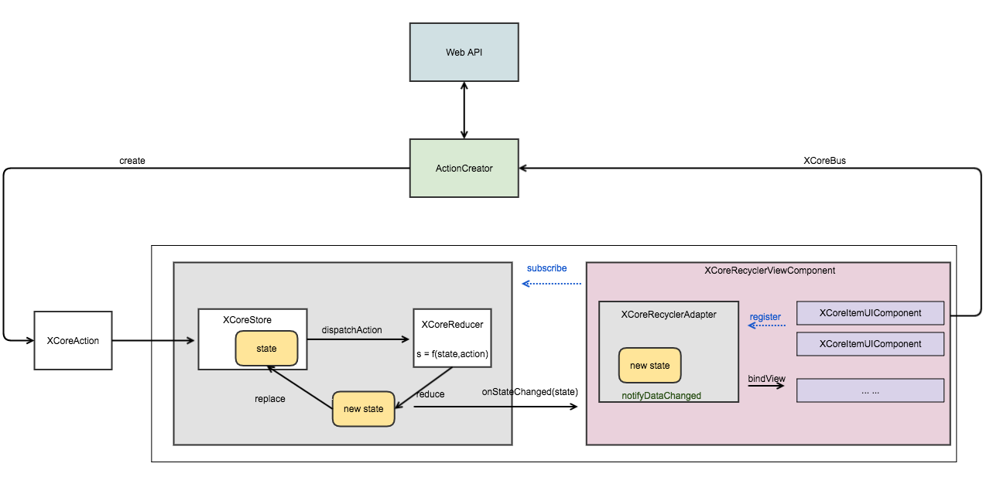

## XCoreRedux框架:Android UI组件化与Redux实践
@author: 莫川 [https://github.com/nuptboyzhb/](https://github.com/nuptboyzhb/)<br>
XCoreRedux源码+Demo：[https://github.com/nuptboyzhb/XCoreRedux](https://github.com/nuptboyzhb/XCoreRedux)<br>
使用android studio打开该项目。
### 目录结构
- demo <br>
  基于xcore框架写的一个小demo
- xcore <br>
  XCoreRedux核心代码库
- pics <br>
  文档的pic资源 

### 前言
- Android开发当中的Code Architecture思考<br>
最近看了很多前端的框架，React、Flux、Redux等，React和Redux都是前端比较流行的框架。而android方面，Google官方貌似不太Care此事，业内也没有公认的优秀Architecture。与前端类似，在Android开发中，同样也面临着复杂的数据state管理的问题。在理解Store、Reducer和Action的基础上，最终，基于Redux+React的思想，提出了一个基于Android平台Redux框架，我给它起名叫作：XCoreRedux。本仓库就是XCoreRedux+UIComponent框架的实现。它表达的是一种思想，希望大家能够提出更好的意见。

### XCoreRedux框架介绍

与前端的Redux框架类似，XCoreRedux框架的图示如下：



#### Action

Action 是把数据传到 store 的有效载体。它是store的唯一数据来源。我们一般是通过 store.dispatch()将action传到store中。Action一般需要两个参数：type类型和data数据。在XCoreRedux框架下，我们定义Action如下：

``` java

public class XCoreAction {

    //Action的类型
    public final String type;
    //Action携带的value,可为空
    public final Object value;

    public XCoreAction(String type, Object value) {
        this.type = type;
        this.value = value;
    }

    public XCoreAction(String type) {
        this(type, null);
    }

    @Override
    public boolean equals(Object object) {
       ...
    }

    @Override
    public int hashCode() {
        ...
    }
}
```

为了统一的管理Action，你可以实现一个ActionCreator,比如，demo中创建了一个联系人业务的Creator：

``` java

/**
 * @version mochuan.zhb on 16/9/28.
 * @Author Zheng Haibo
 * @Blog github.com/nuptboyzhb
 * @Company Alibaba Group
 * @Description 联系人 ActionCreator
 */
public class ContactsActionCreator {

    public static final String ADD_ITEM = "AddContacts";
    public static final String ADD_TITLE = "addCategory";
    public static final String DELETE_LAST = "deleteLast";
    public static final String CHECK_BOX = "contactsCheck";

    public static XCoreAction addContacts(Contacts contacts) {
        return new XCoreAction(ADD_ITEM, contacts);
    }

    public static XCoreAction addCategory(Title title) {
        return new XCoreAction(ADD_TITLE, title);
    }

    public static XCoreAction deleteLast() {
        return new XCoreAction(DELETE_LAST);
    }

    public static XCoreAction checkBoxClick(ContactsWrapper contactsWrapper) {
        return new XCoreAction(CHECK_BOX, contactsWrapper);
    }
}

```

Action的概念比较好理解，下面我们看一下Reducer
#### Reducer
reducer的字面意思就是“减速器”。Action描述了事件，Reducer是决定如何根据Action更新状态(state)，而这正是reducer要做的事情。Reducer的接口定义如下：

``` java

public interface IXCoreReducer<State> {
    State reduce(State state, XCoreAction xcoreAction);
}
```

就是根据输入的Action和当前的state，处理得到新的state。

``` java

(previousState, action) => newState

```
说的更直白一点，Reducer就是一些列 **纯函数** 的集合。如Demo中的项目所示：

``` java

public class ContactsReducer implements IXCoreReducer<List<XCoreRecyclerAdapter.IDataWrapper>> {

    /**
     * 添加联系人
     *
     * @param contactsWrappers
     * @param contacts
     * @return
     */
    private List<XCoreRecyclerAdapter.IDataWrapper> addOneContacts(List<XCoreRecyclerAdapter.IDataWrapper> contactsWrappers, Contacts contacts) {
        ...
        ...
        return wrappers;
    }

    /**
     * 添加标题
     *
     * @param contactsWrappers
     * @param value
     * @return
     */
    private List<XCoreRecyclerAdapter.IDataWrapper> addOneTitle(List<XCoreRecyclerAdapter.IDataWrapper> contactsWrappers, Title value) {
        ...
        ...
        return wrappers;
    }

    /**
     * 删除最后一个
     *
     * @param contactsWrappers
     * @return
     */
    private List<XCoreRecyclerAdapter.IDataWrapper> deleteLast(List<XCoreRecyclerAdapter.IDataWrapper> contactsWrappers) {
        List<XCoreRecyclerAdapter.IDataWrapper> wrappers = new ArrayList<>(contactsWrappers);
        if (wrappers.size() > 0) {
            wrappers.remove(wrappers.size() - 1);
        }
        return wrappers;
    }

    /**
     * 设置选择状态
     *
     * @param contactsWrappers
     * @param value
     * @return
     */
    private List<XCoreRecyclerAdapter.IDataWrapper> changeCheckBoxStatus(List<XCoreRecyclerAdapter.IDataWrapper> contactsWrappers, ContactsWrapper value) {
        value.isChecked = !value.isChecked;
        return contactsWrappers;
    }

    @Override
    public List<XCoreRecyclerAdapter.IDataWrapper> reduce(List<XCoreRecyclerAdapter.IDataWrapper> contactsWrappers, XCoreAction xcoreAction) {
        switch (xcoreAction.type) {
            case ContactsActionCreator.ADD_ITEM:
                return addOneContacts(contactsWrappers, (Contacts) xcoreAction.value);

            case ContactsActionCreator.ADD_TITLE:
                return addOneTitle(contactsWrappers, (Title) xcoreAction.value);

            case ContactsActionCreator.DELETE_LAST:
                return deleteLast(contactsWrappers);

            case ContactsActionCreator.CHECK_BOX:
                return changeCheckBoxStatus(contactsWrappers, (ContactsWrapper) xcoreAction.value);
            ...
        }
        return contactsWrappers;
    }
}

```

通过上面的Reducer实现，我们可以看出，Reducer就是一些列函数的集合，其中一个关键函数reduce，它按照action的不同type执行不同的方法处理。
#### Store
store字面意思是存储。在Redux框架下，Store和DataBase,File没有关系，它可不是持久化存储的意思。Store是负责管理数据源的状态，负责把Action和Reducer联系到一起。Store的职责为：

- 1.保存数据源的当前状态state
- 2.对外提供dispatch方法，更新state
- 3.通过subscribe注册监听器，当state变化时，通知观察者
- 4.提供getState方法，获取当前的state

Store的Java实现：

``` java

public class XCoreStore<State> {
    private final IXCoreReducer<State> mIXCoreReducer;//数据处理器-reducer
    private final List<IStateChangeListener<State>> listeners = new ArrayList<>();//观察者
    private volatile State state;//Store存储的数据

    private XCoreStore(IXCoreReducer<State> mIXCoreReducer, State state) {
        this.mIXCoreReducer = mIXCoreReducer;
        this.state = state;
    }

    /**
     * 内部dispatch
     *
     * @param xCoreAction
     */
    private void dispatchAction(final XCoreAction xCoreAction) throws Throwable {
        synchronized (this) {
            state = mIXCoreReducer.reduce(state, xCoreAction);
        }
        for (IStateChangeListener<State> listener : listeners) {
            listener.onStateChanged(state);
        }
    }


    /**
     * 创建Store
     *
     * @param reducer
     * @param initialState
     * @param <S>
     * @return
     */
    public static <S> XCoreStore<S> create(IXCoreReducer<S> reducer, S initialState) {
        return new XCoreStore<>(reducer, initialState);
    }

    public State getState() {
        return state;
    }


    public void dispatch(final XCoreAction action) {
        try {
            dispatchAction(action);
        } catch (Throwable e) {
            e.printStackTrace();
        }
    }

    /**
     * 注册接口;添加观察者,当state改变时,通知观察者
     *
     * @param listener
     */
    public void subscribe(final IStateChangeListener<State> listener) {
        listeners.add(listener);
    }

    /**
     * 注销
     *
     * @param listener
     */
    public void unSubscribe(final IStateChangeListener<State> listener) {
        listeners.remove(listener);
    }

    /**
     * 状态改变的回调接口
     *
     * @param <S> 状态
     */
    public interface IStateChangeListener<S> {
        void onStateChanged(S state);
    }

}

```

在Android中，一个Redux页面(Fragment或者Activity) 只有一个单一的 store。当需要拆分数据处理逻辑时，应该使用 reducer组合，而不是创建多个Store。

#### 搭配UIComponent
与前端的Redux搭配React类似，XCoreRedux搭配UIComponent。

### UI组件化(UIComponent)
在前段的React框架下，我们常常听说组件的概念：‘UI组件’。那么什么是UI组件呢？以下图为例：<br>

红色的区域为“普通组件”，绿色的区域为两种不同类型的“Item组件”。因此，在UIComponent里，组件分两种：普通组件和item组件(或称为cell组件)。

#### 普通组件
- 单组件，比如一个自定义的Widget，就是一样View。比如自定义的CircleImageView等。
- 容器组件，由ViewGroup派生出的组件。有FrameLayout、LinearLayout、RelativeLayout等。还有些常见的列表组件，比如ListView或者RecyclerView的组件等。

普通组件在XCore中是以FrameLayout的形式封装的，编写一个普通组件只需要实现如下方法：<br>

- 1.public int getLayoutResId()<br>
    返回组件的布局资源Id
- 2.public void onViewCreated(View view)<br>
    View初始化
- 3.实现XCoreStore中的IStateChangeListener接口，在onStateChanged中做数据绑定
    为了使UI组件能够与Store进行关联，UI组件可以实现IStateChangeListener接口，然后作为观察者，观察Store的state变化。然后在onStateChanged方法中做数据绑定。

#### Item组件(Cell组件)
对于前端来说，item组件和普通组件并没有什么不同。但是对于Android或者iOS而言，item组件和普通组件是有本质区别的。以ReyclerView为例，Item组件在同一种类型下是会复用的。在XCoreRedux框架中，定义Item组件，需要继承自XCoreItemUIComponent，它本身并不是一个View。它只需要实现的方法有：

- View onCreateView(LayoutInflater inflater,ViewGroup container);
  与Fragment的onCreateView类似，它负责创建item的布局View
- void onViewCreated(View view);
  与Fragment的onViewCreated类似，在此写View的初始化
- public String getViewType();
  Item组件对于数据源的类型
- public void bindView(IXCoreComponent coreComponent,
                                  XCoreRecyclerAdapter coreRecyclerAdapter,
                                  XCoreRecyclerAdapter.IDataWrapper data,
                                  int pos);
  数据绑定，当Adapter调用bindViewHolder时，会回调bindView方法。

Item组件需要通过Adapter，与对应的列表组件联系起来。针对Android常用的RecyclerView，XCoreRedux提供了插件式的通用XCoreRecyclerAdapter。
### 含列表组件下的XCoreRedux框架图



与之前的不同之处在于，这里把整个列表封装成一个列表组件，对外提供注册Item，比如XCoreRecyclerViewComponent组件源码。

``` java

public class XCoreRecyclerViewComponent extends XCoreUIBaseComponent implements XCoreStore.IStateChangeListener<List<XCoreRecyclerAdapter.IDataWrapper>> {

    private SwipeRefreshLayout mSwipeRefreshLayout;

    private RecyclerView mRecyclerView;
    private RecyclerView.LayoutManager mLayoutManager;
    private XCoreRecyclerAdapter mXCoreRecyclerAdapter;

    public XCoreRecyclerViewComponent(Context context) {
        super(context);
    }

    public XCoreRecyclerViewComponent(Context context, AttributeSet attrs) {
        super(context, attrs);
    }

    public XCoreRecyclerViewComponent(Context context, AttributeSet attrs, int defStyleAttr) {
        super(context, attrs, defStyleAttr);
    }

    @Override
    public final int getLayoutResId() {
        return R.layout.xcore_recyclerview_component;
    }

    @Override
    public void onViewCreated(View view) {
        //初始化View
        mSwipeRefreshLayout = (SwipeRefreshLayout) findViewById(R.id.xcore_refresh_layout);
        mSwipeRefreshLayout.setEnabled(false);
        mRecyclerView = (RecyclerView) findViewById(R.id.xcore_rv);
        //初始化RecyclerView
        mLayoutManager = new LinearLayoutManager(getContext());
        mRecyclerView.setLayoutManager(mLayoutManager);
        mXCoreRecyclerAdapter = new XCoreRecyclerAdapter(this);
        mRecyclerView.setAdapter(mXCoreRecyclerAdapter);
    }

    public SwipeRefreshLayout getSwipeRefreshLayout() {
        return mSwipeRefreshLayout;
    }

    public RecyclerView getRecyclerView() {
        return mRecyclerView;
    }

    public RecyclerView.LayoutManager getLayoutManager() {
        return mLayoutManager;
    }

    public XCoreRecyclerAdapter getXCoreRecyclerAdapter() {
        return mXCoreRecyclerAdapter;
    }

    /**
     * 当状态发生变化时,自动通知
     *
     * @param status
     */
    @Override
    public void onStateChanged(List<XCoreRecyclerAdapter.IDataWrapper> status) {
        mXCoreRecyclerAdapter.setDataSet(status);
        mXCoreRecyclerAdapter.notifyDataSetChanged();
    }

    /**
     * 对外提供item组件的注册
     *
     * @param xCoreItemUIComponent
     * @return
     */
    public XCoreRecyclerViewComponent registerItemComponent(XCoreItemUIComponent xCoreItemUIComponent) {
        mXCoreRecyclerAdapter.registerItemUIComponent(xCoreItemUIComponent);
        return this;
    }

    public void setRefreshEnable(boolean enable) {
        mSwipeRefreshLayout.setEnabled(enable);
    }
}
```

我们在使用该组件时，只需要：<br>
1.在XML中添加组件<br>

``` XML

<?xml version="1.0" encoding="utf-8"?>
<LinearLayout xmlns:android="http://schemas.android.com/apk/res/android"
    android:layout_width="match_parent"
    android:layout_height="match_parent"
    android:orientation="vertical">
    <!-- 头部组件-->
    <com.example.haibozheng.myapplication.components.container.HeaderComponent
        android:id="@+id/recycler_view_header_component"
        android:layout_width="match_parent"
        android:layout_height="wrap_content" />
    <!-- 列表组件-->
    <com.github.nuptboyzhb.xcore.components.impl.XCoreRecyclerViewComponent
        android:id="@+id/recycler_view_component"
        android:layout_width="match_parent"
        android:layout_height="match_parent" />
</LinearLayout>

```

2.初始化<br>

``` java
        
        ...
        //创建数据源的store
        mContactsListXCoreStore = XCoreStore.create(new ContactsReducer(), new ArrayList<XCoreRecyclerAdapter.IDataWrapper>());

        //创建RecyclerView的UI组件
        mXCoreRecyclerViewComponent = (XCoreRecyclerViewComponent) findViewById(R.id.recycler_view_component);
        //注册item组件模板
        mXCoreRecyclerViewComponent.registerItemComponent(new TextItemComponent())
                .registerItemComponent(new ImageItemComponent());

        //创建头部组件
        mHeaderComponent = (HeaderComponent) findViewById(R.id.recycler_view_header_component);

        //添加观察者
        mContactsListXCoreStore.subscribe(mXCoreRecyclerViewComponent);
        mContactsListXCoreStore.subscribe(mHeaderComponent);
        ...
```
### 组件之间通信
Item组件与列表组件及普通组件之间的通信。在本Demo中使用的EventBus是轻量级的[otto](https://github.com/square/otto)。每一个继承自XCoreUIBaseComponent的组件，都已经在onCreate和onDestroy中分别进行了注册和反注册。使用时，只需要使用@Subscribe 注解来指定订阅方法。因此，在任意地方都可以调用：<br>

``` java 
XCoreBus.getInstance().post(action);
```

### 小优化
对于数据绑定方面，做了两个优化：
1.把数据通过Wrapper包装
2.使用UIBinderHelper做流式绑定，比如：

``` java

public class ImageItemComponent extends XCoreItemUIComponent implements View.OnClickListener {

    private UIBinderHelperImpl mUIBinderHelperImpl;

    ...

    @Override
    public void bindView(IXCoreComponent coreComponent,
                         XCoreRecyclerAdapter coreRecyclerAdapter,
                         XCoreRecyclerAdapter.IDataWrapper data,
                         int pos) {
        mContactsWrapper = (ContactsWrapper) data;
        mUIBinderHelperImpl.from(R.id.item_content_tv).setText(mContactsWrapper.bindContentText())
                .from(R.id.item_pic_iv).setImageUrl(mContactsWrapper.getAvatarUrl())
                .from(R.id.item_title_tv).setText(mContactsWrapper.bindItemTitle())
                .from(R.id.checkbox).setButtonDrawable(mContactsWrapper.isChecked ? R.mipmap.checkbox_checked : R.mipmap.checkbox_normal)
                .setOnClickListener(this);
    }

    ...
}
```

###后续
- 1.异步
- 2.Middleware中间件
- 3.与Rx结合

###参考文献
- 1. [Redux中文文档](http://cn.redux.js.org/docs/basics/Reducers.html)
- 2. [Flux and Android](http://armueller.github.io/android/2015/03/29/flux-and-android.html)
- 3. [AndroidFlux一览](http://androidflux.github.io/docs/overview.html#content)


### License

Copyright 2016  [Zheng Haibo](https://github.com/nuptboyzhb/)

Licensed under the Apache License, Version 2.0 (the "License");
you may not use this file except in compliance with the License.
You may obtain a copy of the License at

   http://www.apache.org/licenses/LICENSE-2.0

Unless required by applicable law or agreed to in writing, software
distributed under the License is distributed on an "AS IS" BASIS,
WITHOUT WARRANTIES OR CONDITIONS OF ANY KIND, either express or implied.
See the License for the specific language governing permissions and
limitations under the License.


